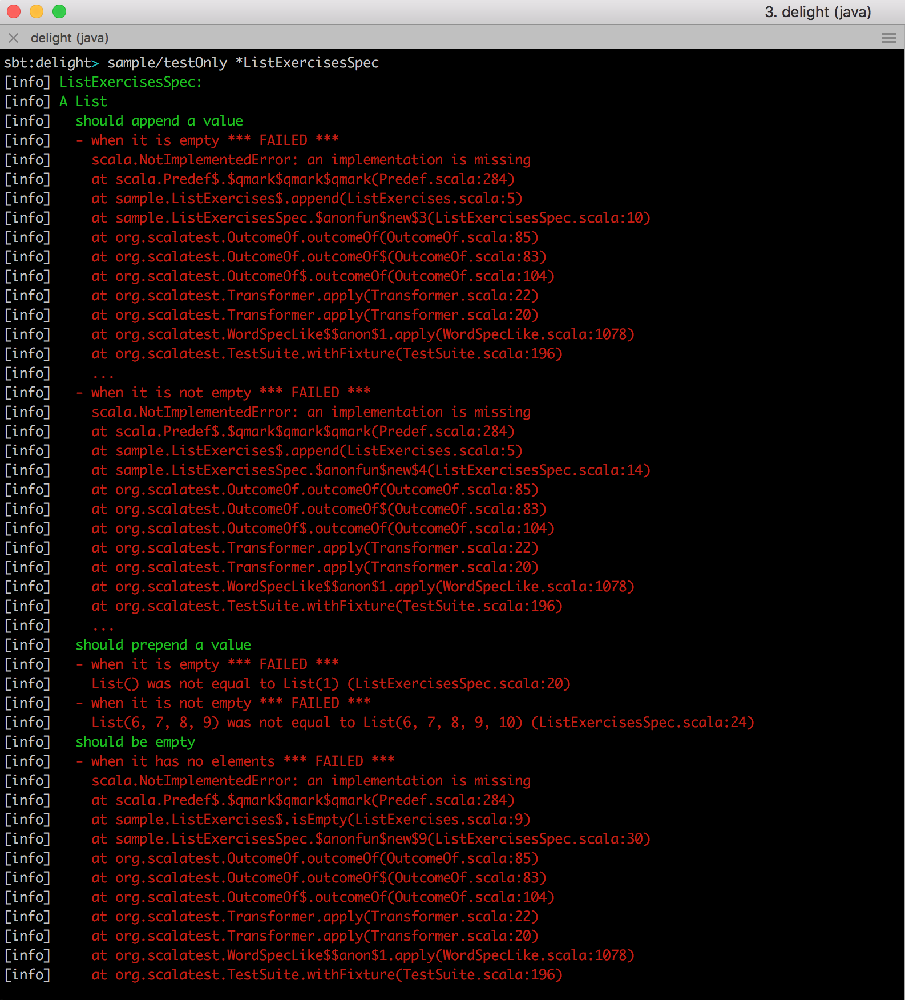
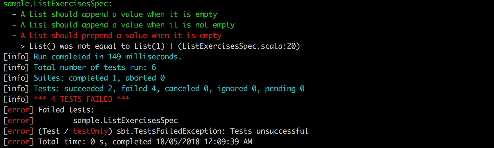
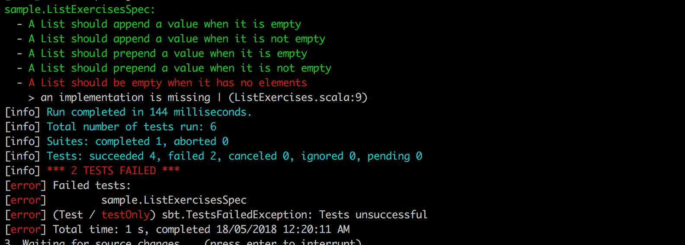
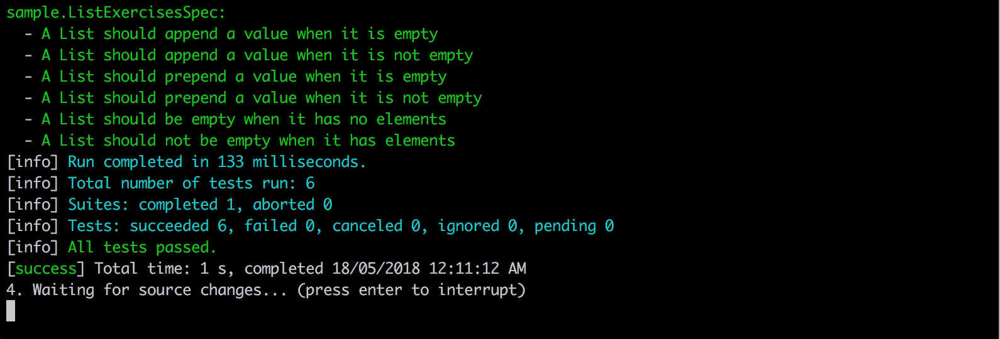
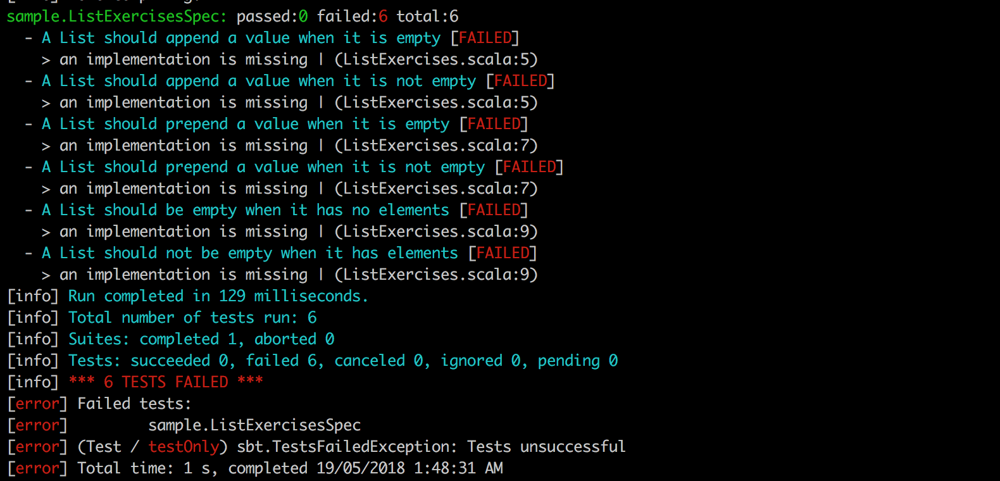
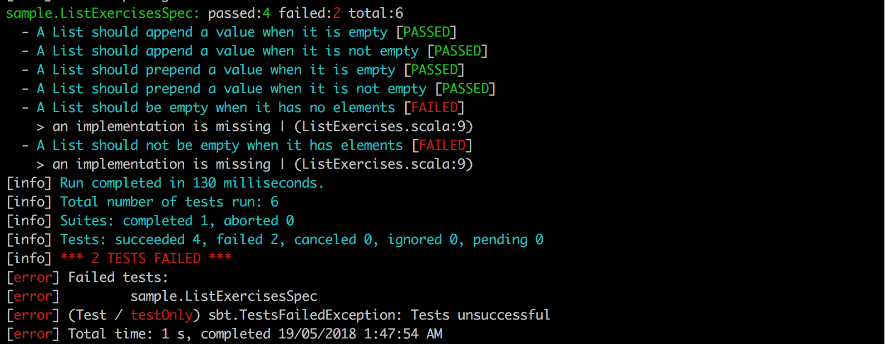

# Delight #

[](https://travis-ci.org/ssanj/delight)

Delight is a small collection of [ScalaTest](http://www.scalatest.org/) Reporters that make running your tests a more pleasant experience. These reporters are meant to be run through [SBT](https://www.scala-sbt.org/) although there is nothing stopping you from running them through an IDE.

Often when participating in a workshop or even while refactoring some code, you might have find yourself drowning in a sea of broken tests:



Often the multiple Stacktrace lines shown are unnecessary and there is only a single useful Stacktrace line. Wouldn't it be nice if we didn't have to see all this superfluous information?

In a workshop you have to go through each module implementing solutions as you go and thereby fixing the tests. If there are lots of failing tests, it becomes hard to figure out which tests are failing and for what reason. Did you fix a test? It's almost impossible to see without scrolling to the top of your terminal.

In the case of a broken refactoring even though many tests fail, if you fix one test you usually end up fixing them all.

What if we could just reduce the noise of these failing tests and just focus on one thing at a time?


## Little Red


[Litte Red from Threadless](https://www.threadless.com/product/1586/RED/style,design)


This reporter shows all tests that pass and only the first test that fails. Once you fix the first failing test, the next failing test is shown. The Stacktrace is also truncated to only one line with the most relevant information. The objective of this reporter is to get out of your way and help you focus on the task at hand.

We can use the LittleRed reporter supplying the following parameters to ScalaTest:

```
-- -C delight.LittleRed
```

For example to run the [ListExercisesSpec](https://github.com/ssanj/delight/blob/master/sample/src/test/scala/sample/ListExercisesSpec.scala) in the `sample` project, first switch to the sample project:

```
project sample
```

Next run Little Red:

```
~testOnly *ListExercisesSpec -- -C delight.LittleRed
```

With six failing tests, it only reports the first failing test:


Let's fix the implementation of the `append` function:

```
def append[A](value: A, list: List[A]): List[A] = list :+ value
```

Once we fix the implementation, we see the tests that were fixed plus the next failing test:



Next let's fix the implementation of the `prepend` function:

```
def prepend[A](list: List[A], value: A): List[A] = value :: list
```

After we fix the implementation we see the next failing tests:



Once we fix the implementation of the `isEmpty` function:

```
def isEmpty[A](list: List[A]): Boolean = list.foldLeft(true)((_, _) => false)
```

we see that all the tests pass!



## Nature


[Nature from Threadless](https://www.threadless.com/product/8704/Nature_will_win/)

The Nature reporter shows all failing and passing tests. The objective of this reporter is to show as much useful information as possible without overloading the senses.

We can use the Nature reporter supplying the following parameters to ScalaTest:

```
-- -C delight.Nature
```

For example to run the [ListExercisesSpec](https://github.com/ssanj/delight/blob/master/sample/src/test/scala/sample/ListExercisesSpec.scala) in the `sample` project, first switch to the sample project:

```
project sample
```

Next run Nature:

```
~testOnly *ListExercisesSpec -- -C delight.Nature
```



It lets you see the forest for the trees. It does this by doing the following:

- Shows a single Stacktrace line per error
- Has a quick summary of passed, failed and total tests run
- Passed and failed tests have a short green or red PASSED or FAILED text respectively. This prevents drowning the user in a sea of red or green

After fixing some of the tests:




## Installation

### Bintray

Add the following to your `build.sbt`:

```scala
libraryDependencies += "net.ssanj" %% "delight" % "0.0.2"
```


### Local

Clone this repo and install it locally from SBT with:

```scala
project delight
publishLocal
```

You can then include it in any SBT project as per usual:

```scala
libraryDependencies += "net.ssanj" %% "delight" % "0.0.2"
```

## Publishing

To publish a new version perform the following tasks:

```
project delight
publish
bintrayRelease
```