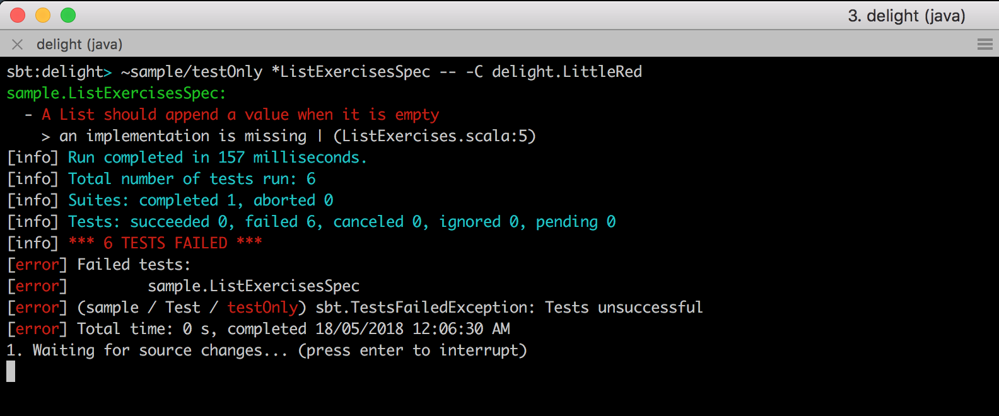

# Delight #

[](https://travis-ci.org/ssanj/delight)

Delight is a small collection of [ScalaTest](http://www.scalatest.org/) Reporters that make running your tests more pleasant experience.

Often when participating in a workshop or even while refactoring some code, you might have find yourself drowning in a sea of broken tests:


Often the multiple Stacktrace lines shown are unnecessary and there is only a single useful Stacktrace line. Wouldn't it be nice if we didn't have to see all this superfluous information?

In a workshop you have to work through each module implementing the tests as you go. It becomes hard to figure out which tests are failing and for what reason because all you see is a wall of red failing tests. Did you fix a test? It's almost impossible to see without scrolling to the top of your terminal.

In the case of a broken refactoring even though many tests fail, if you fix one test you usually end up fixing them all.

What if we could just reduce the noise of these failing tests and just focus on one thing at a time?


## Little Red

This reporter shows all tests that pass and only the first test that fails. Once you fix the first failing test, the next failing test is shown. The Stacktrace is also truncated to only one line with the most relevant information. The objective of this reporter is to get out of your way and help you focus on the task at hand.

We can use the LittleRed report supplying the following parameters to ScalaTest:

```
-- -C delight.LittleRed
```

For example to run the [ListExercisesSpec](https://github.com/ssanj/delight/blob/master/sample/src/test/scala/sample/ListExercisesSpec.scala) with LittleRed use:

```
~testOnly *ListExercisesSpec -- -C delight.LittleRed
```

With six failing tests, it only reports the first failing test:



Once we fix the first test, we see the tests we fixed plus the next failing test:


After we fix the next failing test:


And once we fix all the tests:

